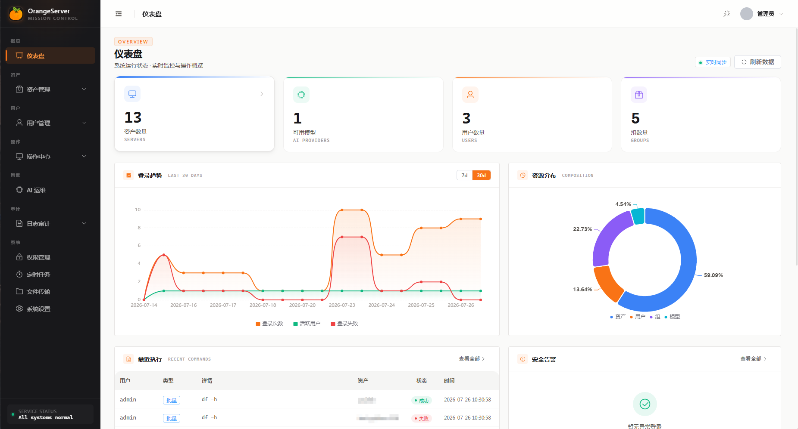
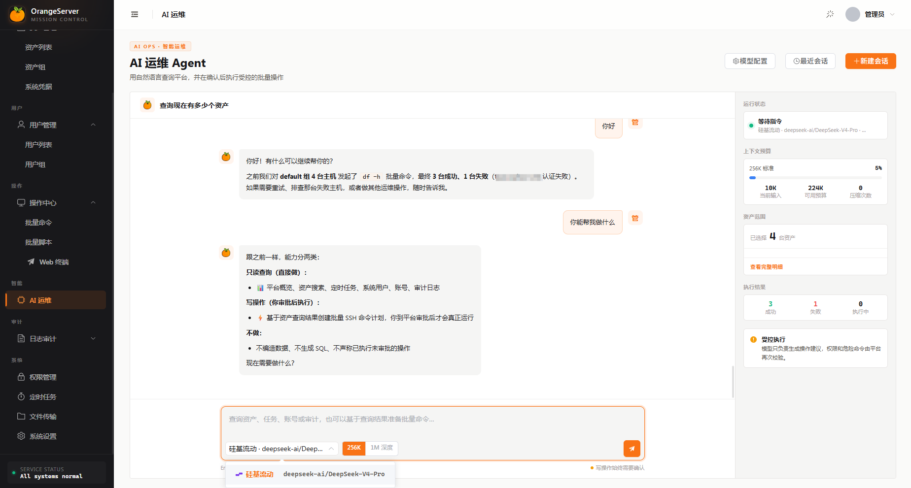
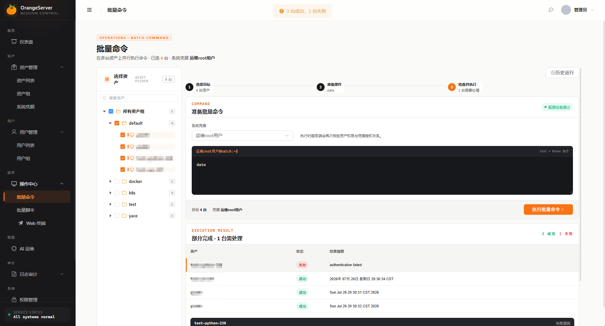
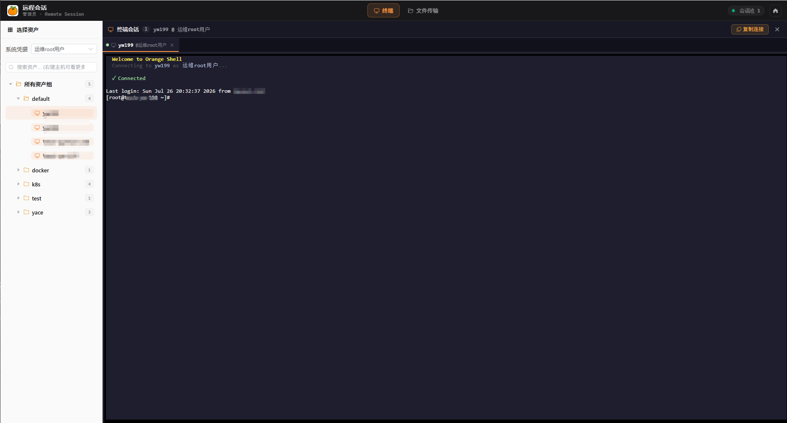
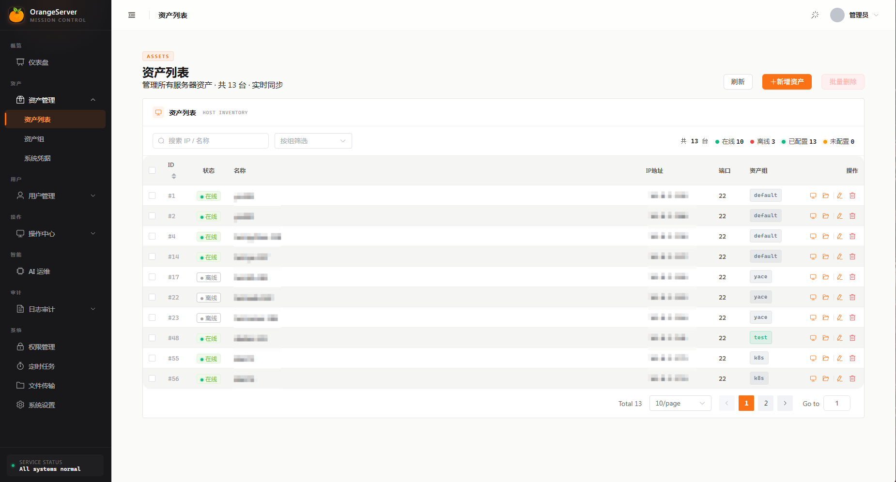
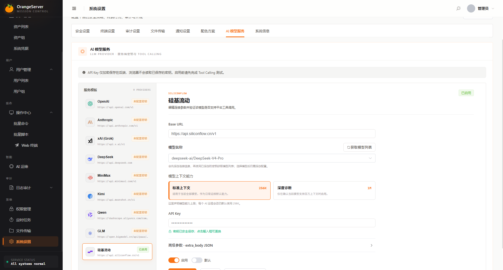
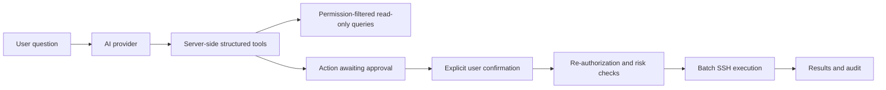
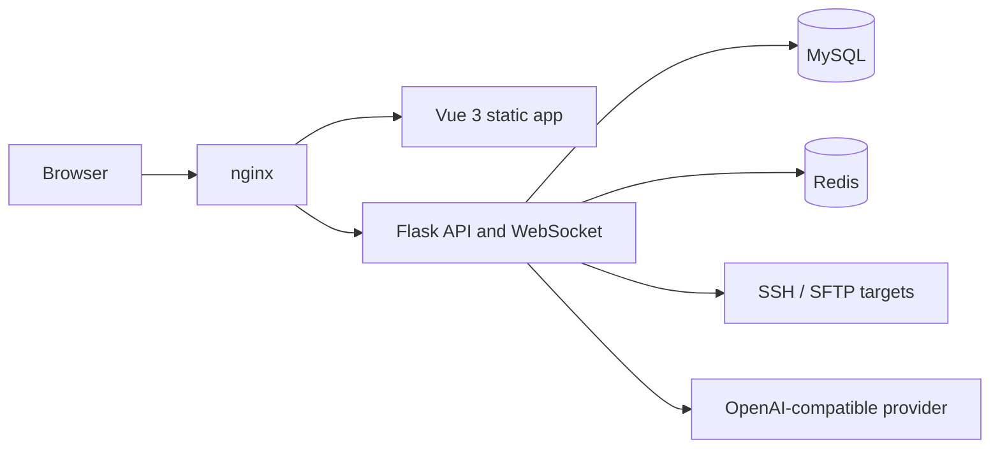

<div align="center">
  <br>
  <h1>OrangeServer</h1>
  <p><strong>Auditable operations from inventory to execution.</strong></p>
  <p>
    A self-hosted operations platform for Linux assets, SSH access, batch jobs,
    file transfer, scheduling, audit trails, and approval-gated AI assistance.
  </p>
  <p>
    <a href="README.zh-CN.md">简体中文</a> ·
    <a href="https://orangeservers.github.io/OrangeServer/">Website</a> ·
    <a href="https://orangeservers.github.io/OrangeServer/guide/deployment.html">Deployment</a> ·
    <a href="docs/README.md">Repository docs</a> ·
    <a href="SECURITY.md">Security</a>
  </p>
  <p>
    <a href="https://github.com/OrangeServers/OrangeServer/actions/workflows/ci.yml"></a>
    <a href="LICENSE"></a>
    
    
  </p>
</div>

## Screenshots

<table>
  <tr>
    <td align="center"><br><sub>Dashboard · live overview and AI execution stats</sub></td>
    <td align="center"><br><sub>AI operations · approval-gated batch actions</sub></td>
  </tr>
  <tr>
    <td align="center"><br><sub>Batch commands · per-asset results and audit</sub></td>
    <td align="center"><br><sub>Web terminal · browser SSH with session recording</sub></td>
  </tr>
  <tr>
    <td align="center"><br><sub>Assets · inventory, groups, and credentials</sub></td>
    <td align="center"><br><sub>AI providers · encrypted keys and tool-calling tests</sub></td>
  </tr>
</table>

<!-- TODO: AI operations demo video. GitHub renders a video player when an
     .mp4/.mov is dropped directly into this Markdown file in the web editor. -->

## What it does

OrangeServer keeps day-to-day Linux operations inside one permission boundary:

| Capability | Current behavior |
|---|---|
| Assets and groups | Manage hosts, groups, tags, and system accounts |
| Web terminal | Browser SSH sessions with tabs and session recording |
| Batch commands and scripts | Run across up to 50 authorized assets with per-asset results and audit logs |
| File transfer | Browse and transfer files on targets over SFTP |
| Scheduled jobs | Manage cron-style jobs and inspect recent results |
| Authorization | Map platform users/groups to assets/groups and system accounts |
| Audit | Query login, command, and platform operation trails |
| AI operations | Query authorized data, run fixed read-only diagnostics, and prepare batch actions that require human approval |
| Bilingual UI | Full Chinese/English interface; switch instantly under Settings → Appearance & Language, persisted server-side |

## AI operations is not "handing the shell to a model"

The model can only call structured tools declared by the backend:

1. Read-only queries always use the signed-in user's asset and feature permissions.
2. Query results are pinned by a server-side `result_set_id`; the model cannot widen the target scope on its own.
3. Batch commands first create a short-lived action awaiting approval.
4. On confirmation, the backend revalidates the action owner, session, assets, system account, and dangerous-command rules.
5. Execution reuses the existing SSH services and writes the normal command and operation audits.
6. Conversations read the action's final authoritative state, so partial failures are never misreported as "not executed yet".


```mermaid
flowchart LR
    U["User question"] --> A["AI provider"]
    A --> T["Server-side structured tools"]
    T --> Q["Permission-filtered read-only queries"]
    T --> P["Action awaiting approval"]
    P --> C["Explicit user confirmation"]
    C --> V["Re-authorization and risk checks"]
    V --> E["Batch SSH execution"]
    E --> R["Results and audit"]
```

The current release ships fixed read-only Linux/Docker diagnostics: the model
selects server-owned profiles and structured parameters and cannot submit
diagnostic shell. Evidence is redacted, size-limited, and stored encrypted, and
rule findings must cite evidence IDs from the current run. Any fix that changes
host state still requires a separate approval-gated action. See
[controlled read-only diagnostics](docs/ai/DIAGNOSTICS.md).

## Quick start

Requirements: Docker Engine with Docker Compose v2, `curl`, `make`, `openssl`,
`sed`, `tar`, `sha256sum`, and `mktemp`. Run the launcher as root (for example
through `sudo`).

```bash
curl -fsSL \
  https://github.com/OrangeServers/OrangeServer/releases/download/v1.0.1/bootstrap-compose.sh \
  | sudo bash -s -- --version v1.0.1
```

This version-pinned launcher downloads and verifies the matching deployment
bundle, generates the MySQL and Redis infrastructure passwords, and starts the
published `ghcr.io/orangeservers/orangeserver-backend:v1.0.1` image. Review the
launcher first if your environment does not permit piping downloaded scripts to
a shell.

Open `http://<server>:8080`. If setup is pending, complete `/setup` and sign in
with the administrator created by the wizard. `admin` / `admin` exists only
when the wizard is bypassed and the baseline seed is retained; change it
immediately. Source checkout, host-database, and physical-machine paths remain
available in the [deployment guide](DEPLOY.md).

> When upgrading an existing instance, do not just `git pull`. Back up first,
> then run database migrations and verification in order following the
> [upgrade procedure](docs/operations/UPGRADE.md).

To configure AI providers, sign in as an administrator and open
"System settings → AI providers": pick a preset (OpenAI, Anthropic, xAI,
DeepSeek, MiniMax, Kimi, Qwen, GLM, or SiliconFlow), fill in the model ID and
API key, test tool calling, then save and enable. Keys are Fernet-encrypted on
the backend and never returned to the browser. Details:
[providers and context](docs/ai/PROVIDER_AND_CONTEXT.md).

## Architecture


```mermaid
flowchart LR
    Browser["Browser"] --> Nginx["nginx"]
    Nginx --> Frontend["Vue 3 static app"]
    Nginx --> API["Flask API and WebSocket"]
    API --> MySQL[("MySQL")]
    API --> Redis[("Redis")]
    API --> Targets["SSH / SFTP targets"]
    API --> Provider["OpenAI-compatible provider"]
```

- Backend: Python 3.12, Flask, Gunicorn, gevent, SQLAlchemy, Paramiko.
- Frontend: Vue 3, TypeScript, Vite, Element Plus, ECharts, xterm.js.
- Data: MySQL for durable business and audit data; Redis for sessions, caches,
  AI conversations, result sets, and pending actions.
- Deployment: Docker Compose is the recommended path; systemd, Supervisor, and
  Kubernetes examples are provided.

## Documentation

- [Project website](https://orangeservers.github.io/OrangeServer/)
- [Website deployment guide](https://orangeservers.github.io/OrangeServer/guide/deployment.html)
- [Documentation index](docs/README.md)
- [Deployment guide](DEPLOY.md)
- [Upgrade procedure](docs/operations/UPGRADE.md)
- [Batch commands and scripts](docs/operations/BATCH_OPERATIONS.md)
- [Configuration reference](CONFIG.md)
- [AI operations guide](docs/ai/USER_GUIDE.md)
- [Architecture and trust boundaries](docs/architecture/TRUST_BOUNDARIES.md)
- [AI API and SSE contract](docs/ai/API.md)
- [AI troubleshooting](docs/troubleshooting/AI.md)

## Project status

OrangeServer is under active development. The current AI capability covers
permission-filtered platform queries, evidence-backed read-only Linux/Docker
diagnostics, and approval-gated batch commands. External diagnostic adapters
remain future work; see the [changelog](CHANGELOG.md) for released capabilities.

## Security and support

Before production use, replace the initial password and set a dedicated
database account, Fernet keys, Flask secret key, Redis password, HTTPS, and
CSRF origins. Never publish API keys, SSH credentials, real host addresses, or
deployment paths in issues, logs, screenshots, or commits.

- Security reports: [SECURITY.md](SECURITY.md)
- Support: [SUPPORT.md](SUPPORT.md)
- Contributing: [CONTRIBUTING.md](CONTRIBUTING.md)

## License

Licensed under the [Apache License 2.0](LICENSE).
