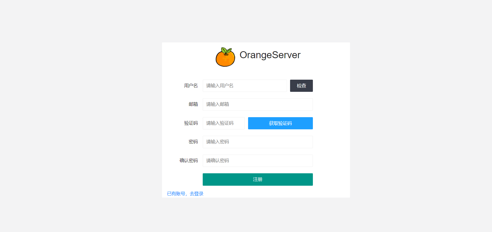
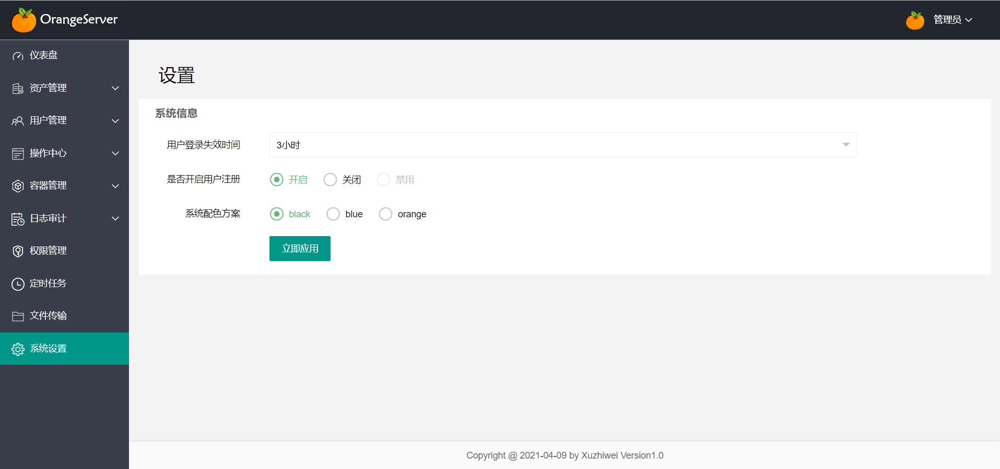

# OrnageServer

### 简介

该项目是orangeserver v1.0的官方文档，安装，使用，部署文档将集中在此，项目的部分还在开发中，前端使用layui+jquery，后端使用flask写的纯接口，其中web终端项目使用的[webssh](https://github.com/huashengdun/webssh)开源项目修改而成。

### 功能概述

- 注册
- 登录
- 资产管理
- 用户管理
- 批量命令
- 批量脚本（目前只支持shell）
- web终端
- 容器管理（还在开发中，暂无功能）
- 日志审计
- 权限管理
- 定时任务（可批量）
- 文件传输（暂时只实现文件上传到后端服务器，文件上传到资产机器还在开发中）
- 系统设置（功能较少，后续完善）

### 部署

##### [后端服务](https://github.com/OrangeServers/OgsBackend)

```shell
# 该项目用到了python3环境，redis，mysql，nginx，需要提前安装
# 下载后端服务压缩包
wget http://58.135.83.162:19612/ogsbackend/v1.0/orangeservers_v1.0.tar.gz

# 解压orangeserver压缩包，导入数据文件
tar -xf orangeservers_v1.0.tar.gz && cd orangeservers
# 安装依赖库
pip3 install -r requirements.txt
# 你的数据库地址用户名和密码
mysql -uxxx -pxxx -hx.x.x.x
mysql> create database orange;
# 导入数据文件
mysql -uxxx -pxxx -hx.x.x.x orange < mysqldir/orange.sql

# 修改后端配置文件
cp app/conf/conf_test_exapmple.py app/conf/conf_test.py
vim app/conf/conf_test.py
# 一般只需要修改这三处即可
# 邮件配置
MAIL_CONF = {
    'form_mail': 'you mail name',         # 邮箱账号 不用邮箱功能也可以不配置
    'password': 'you mail password',        # 邮箱密码 这里通过smtp登录需要去邮箱获取授权码，而非密码
    'smtp_server': 'you mail smtp server'    # 邮箱地址 例如163的 stmp.163.com
}

# mysql配置
MYSQL_CONF = {
    'dbname': 'you dababase name',      # 数据库名
    'user': 'you user name',           # 数据库用户名
    'password': 'you password',       # 数据库用户密码
    'host': 'you db host ip',        # 数据库地址
    'port': 3306                    # 数据库端口号
}

# redis配置
REDIS_CONF = {
    'host': 'you redis ip',           # redis地址
    'port': 6379                    # redis端口号
}

# 启动服务，默认有两个端口 28000和8888
chmod +x start.sh
./start start
```

##### [前端服务](https://github.com/OrangeServers/OgsFront)

```shell
# 下载前端服务压缩包
wget http://58.135.83.162:19612/ogsfront/v1.0/orangefront_v1.0.tar.gz

# 解压压缩包
tar -xf orangefront_v1.0.tar.gz

# 配置nginx配置文件，示例 orangeserver.conf
server {
    listen 8000;

    location / { 
	add_header nw-ip $remote_addr;
        proxy_set_header nw_ip $remote_addr;
        access_log  /data/logs/ogsfront.nginx.log main;
		root /data/tmp/orangefront;      # orangefront文件目录
        index index.html;
        try_files $uri $uri/ $uri $uri.html 404;
    } 


    location /local/ {
        access_log  /data/logs/ogs.nginx.log main;
        proxy_pass_header Server;
        proxy_set_header Host $http_host;
        proxy_redirect off;
        proxy_set_header X-Real-IP $remote_addr;
        proxy_set_header X-Scheme $scheme;
        proxy_set_header X-Route on; 
        proxy_pass http://127.0.0.1:28000;
    }

    location /server/ {
        access_log  /data/logs/ogs.nginx.log main;
        proxy_pass_header Server;
        proxy_set_header Host $http_host;
        proxy_redirect off;
        proxy_set_header X-Real-IP $remote_addr;
        proxy_set_header X-Scheme $scheme;
        proxy_set_header X-Route on; 
        proxy_pass http://127.0.0.1:28000;
    }

    location /account/ {
        access_log  /data/logs/ogs.nginx.log main;
        proxy_pass_header Server;
        proxy_set_header Host $http_host;
        proxy_redirect off;
        proxy_set_header X-Real-IP $remote_addr;
        proxy_set_header X-Scheme $scheme;
        proxy_set_header X-Route on; 
        proxy_pass http://127.0.0.1:28000;
    }

    location /mail/ {
        access_log  /data/logs/ogs.nginx.log main;
        proxy_pass_header Server;
        proxy_set_header Host $http_host;
        proxy_redirect off;
        proxy_set_header X-Real-IP $remote_addr;
        proxy_set_header X-Scheme $scheme;
        proxy_set_header X-Route on; 
        proxy_pass http://127.0.0.1:28000;
    }

    location /auth/ {
        access_log  /data/logs/ogs.nginx.log main;
        proxy_pass_header Server;
        proxy_set_header Host $http_host;
        proxy_redirect off;
        proxy_set_header X-Real-IP $remote_addr;
        proxy_set_header X-Scheme $scheme;
        proxy_set_header X-Route on;
        proxy_pass http://127.0.0.1:28000;
    }

    location /wsh/ {
        access_log  /data/logs/ogs.nginx.log main;
        proxy_http_version 1.1;
    	proxy_read_timeout 300;
    	proxy_set_header Upgrade $http_upgrade;
    	proxy_set_header Connection "upgrade";
    	proxy_set_header Host $host:$server_port;
    	proxy_set_header X-Real-IP $remote_addr;
    	proxy_set_header X-Real-PORT $remote_port;
        proxy_pass http://127.0.0.1:8888/;
    }
}

# 启动nginx
# 访问nginx监听页面，用户名密码默认是：admin  admin
```


### 展示(部分页面)

##### 注册界面

默认不开启，需要登录去设置中开启，邮箱验证需要配置邮箱



##### 登录界面


##### 仪表版


##### 资产管理

需要先创建资产组，将资产关联到资产组


##### 资产组

用于关联资产信息，删除组会附带删除掉组内资产


##### 系统用户

用于关联资产的登录用户，也就是ssh登录的用户信息


##### 用户列表

登录管理平台的用户，被权限管理授予权限


##### 用户组

用于关联登录用户来授权


##### 批量命令

用于批量执行命令，关联资产组内的资产，并通过选择系统用户来执行


##### 批量脚本

用于批量执行脚本（目前只支持shell脚本，需要通过#!/bin/xxx选择解释器），关联资产组内的资产，并通过选择系统用户来执行


##### shell终端

web终端，关联资产组内的资产，并通过选择系统用户来登录


##### 日志审计

各类日志详情整合


##### 权限管理

用来管理某些用户组或用户拥有哪些资产和系统用户的权限


##### 定时任务

用来实现一组资产批量的定时任务


##### 文件传输

用来上传下载文件到后端服务器（直接传到资产服务器功能还在开发中）


##### 系统设置

用来设置整体配置信息（更多功能待开发）


