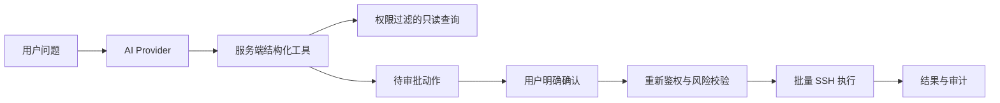
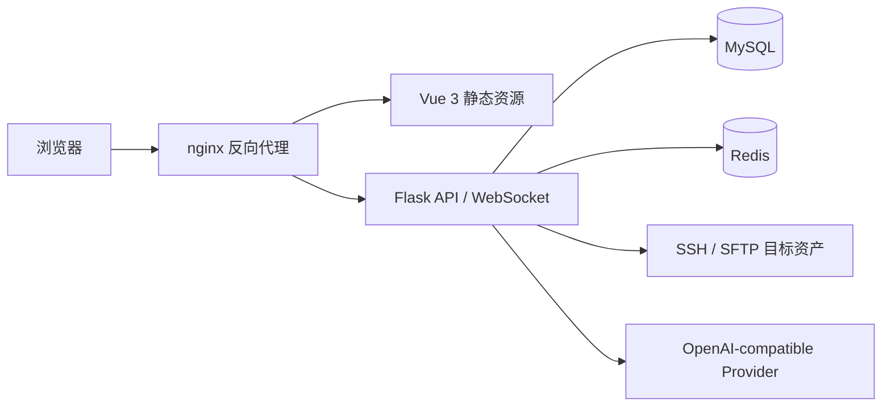

<div align="center">
  <br>
  <h1>OrangeServer</h1>
  <p><strong>从资产管理到命令执行，全程可授权、可审计、可追溯。</strong></p>
  <p>
    面向 Linux 运维场景的自托管平台，整合资产、SSH、批量操作、文件传输、
    定时任务、权限审计和人工审批式 AI 运维。
  </p>
  <p>
    <a href="README.md">English</a> ·
    <a href="https://orangeservers.github.io/OrangeServer/zh/">项目官网</a> ·
    <a href="https://orangeservers.github.io/OrangeServer/zh/guide/deployment.html">部署</a> ·
    <a href="docs/README.md">仓库文档</a> ·
    <a href="SECURITY.md">安全</a>
  </p>
  <p>
    <a href="https://github.com/OrangeServers/OrangeServer/actions/workflows/ci.yml"></a>
    <a href="LICENSE"></a>
    
    
  </p>
</div>

## 界面预览

<table>
  <tr>
    <td align="center"><br><sub>仪表盘 · 实时概览与 AI 执行统计</sub></td>
    <td align="center"><br><sub>AI 运维 · 人工审批式批量操作</sub></td>
  </tr>
  <tr>
    <td align="center"><br><sub>批量命令 · 逐资产结果与审计</sub></td>
    <td align="center"><br><sub>Web 终端 · 浏览器 SSH 与会话记录</sub></td>
  </tr>
  <tr>
    <td align="center"><br><sub>资产 · 主机、分组与系统凭据</sub></td>
    <td align="center"><br><sub>AI 模型服务 · 密钥加密与 Tool Calling 测试</sub></td>
  </tr>
</table>

<!-- TODO: AI 运维演示视频。在 GitHub 网页编辑器中直接拖入 .mp4/.mov
     即可渲染为视频播放器，占位在此。 -->

## 适合解决什么问题

OrangeServer 把日常 Linux 运维工作集中在同一个权限边界内：

| 能力 | 当前行为 |
|---|---|
| 资产与资产组 | 管理主机、分组、标签和系统用户 |
| Web 终端 | 浏览器内建立 SSH 会话，支持多标签和会话记录 |
| 批量命令与脚本 | 对最多 50 台已授权资产批量执行，展示逐资产结果并记录审计日志 |
| 文件传输 | 通过 SFTP 浏览和传输目标资产文件 |
| 定时任务 | 使用 cron 表达式管理周期任务及最近执行结果 |
| 权限管理 | 将平台用户/用户组关联到资产/资产组和系统用户 |
| 日志审计 | 查询登录、命令和平台操作记录 |
| AI 运维 | 查询已授权平台数据，运行固定只读诊断，生成需人工确认的批量操作 |
| 双语界面 | 全站中英双语，设置 → 外观与语言即时切换，持久化到服务端 |

## AI 运维不是"把 Shell 交给模型"

大模型只能调用后端声明的结构化工具：

1. 只读查询始终使用当前登录用户的资产和功能权限。
2. 查询结果使用服务端 `result_set_id` 固定范围，模型不能自行扩充目标。
3. 批量命令先生成短时有效的待审批动作。
4. 用户确认时，后端重新校验动作所有者、会话、资产、系统用户和危险命令。
5. 执行复用现有 SSH 服务，并写入原有命令与操作审计。
6. 对话会读取动作的最终权威状态，部分失败不会被误报为"尚未执行"。



当前版本提供 Linux/Docker 固定只读诊断：模型只能选择服务端档案和结构化参数，
不能提交诊断 Shell。证据会脱敏、限长、加密保存，规则 Finding 必须引用当前诊断
Run 的证据 ID。需要改变主机状态的修复仍必须生成独立审批动作。详见
[受控只读诊断](docs/ai/DIAGNOSTICS.md)。

## 快速开始

要求：Docker Engine、Docker Compose v2，以及 `curl`、`make`、`openssl`、
`sed`、`tar`、`sha256sum`、`mktemp`。引导器需要以 root 身份运行（例如通过
`sudo`）。

```bash
curl -fsSL \
  https://github.com/OrangeServers/OrangeServer/releases/download/v1.0.1/bootstrap-compose.sh \
  | sudo bash -s -- --version v1.0.1
```

这个固定版本的薄引导器会下载并校验同版本部署包，生成 MySQL 与 Redis
基础设施密码，并启动已发布的
`ghcr.io/orangeservers/orangeserver-backend:v1.0.1` 镜像。
如果环境不允许把下载内容直接交给 shell，请先下载并审阅引导器再执行。

浏览器打开 `http://<服务器地址>:8080`。应用未配置时会进入 `/setup`，请使用
向导创建的管理员登录；仅跳过向导并保留基线种子时才存在 `admin/admin`，必须
立即修改。源码检出、复用宿主机数据库和物理机部署仍见
[部署手册](DEPLOY.md)。

> 升级已有实例时，不要只执行 `git pull`。先备份，再按
> [统一升级流程](docs/operations/UPGRADE.md) 顺序执行数据库迁移和验证。

批量操作的能力边界（同步执行、脚本类型与大小限制等）见
[批量命令与批量脚本指南](docs/operations/BATCH_OPERATIONS.md)。
配置 AI 模型服务：管理员进入「系统设置 → AI 模型服务」，选择厂商模板、填写模型
ID 与 API Key、完成 Tool Calling 测试后保存启用；密钥在后端 Fernet 加密、不回传
浏览器。详见 [Provider 与上下文](docs/ai/PROVIDER_AND_CONTEXT.md)。

## 技术架构



- 后端：Python 3.12、Flask、Gunicorn、gevent、SQLAlchemy、Paramiko。
- 前端：Vue 3、TypeScript、Vite、Element Plus、ECharts、xterm.js。
- 数据：MySQL 保存业务与审计数据；Redis 保存会话、缓存、AI 对话、结果集和动作。
- 部署：Docker Compose 为推荐路径，也提供 systemd、Supervisor 和 Kubernetes 示例。

## 文档入口

- [项目官网](https://orangeservers.github.io/OrangeServer/zh/)
- [官网部署指南](https://orangeservers.github.io/OrangeServer/zh/guide/deployment.html)
- [文档中心](docs/README.md)
- [部署手册](DEPLOY.md)
- [统一升级流程](docs/operations/UPGRADE.md)
- [批量命令与批量脚本](docs/operations/BATCH_OPERATIONS.md)
- [配置参考](CONFIG.md)
- [AI 运维使用指南](docs/ai/USER_GUIDE.md)
- [受控只读诊断](docs/ai/DIAGNOSTICS.md)
- [AI Provider 与上下文](docs/ai/PROVIDER_AND_CONTEXT.md)
- [架构与信任边界](docs/architecture/TRUST_BOUNDARIES.md)
- [AI API 与 SSE 契约](docs/ai/API.md)
- [AI 排错](docs/troubleshooting/AI.md)

## 项目状态

OrangeServer 处于活跃开发中。当前 AI 能力覆盖权限过滤的平台查询、证据可溯的
Linux/Docker 只读诊断、以及人工审批式批量命令。外部诊断适配器为后续规划；
已发布能力见 [变更日志](CHANGELOG.md)。

## 开发与贡献

```bash
make install
make dev
make test
make lint
make docs-check
```

前端生产构建：`cd frontend && npm run build`（含类型检查）。提交前运行与改动
匹配的本地检查；完整要求见 [贡献指南](CONTRIBUTING.md)。

## 安全与支持

生产部署前务必更换初始密码、设置独立数据库账号、Fernet 密钥、Flask
Secret Key、Redis 密码、HTTPS 和 CSRF 来源。不要在 Issue、日志、截图或
提交中发布 API Key、SSH 凭据、真实主机地址和部署目录。

- 安全问题：[SECURITY.md](SECURITY.md)
- 使用支持：[SUPPORT.md](SUPPORT.md)
- 参与贡献：[CONTRIBUTING.md](CONTRIBUTING.md)

## 许可证

OrangeServer 采用 [Apache License 2.0](LICENSE)。
