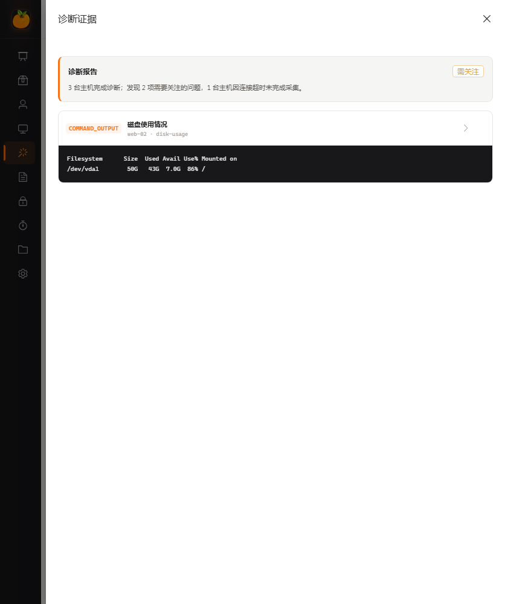

# AI 运维使用指南

OrangeServer AI 运维是权限受控的自然语言入口。它适合查询平台中的结构化数据，
以及准备需要用户审批的批量命令；它不是具有任意数据库、SSH 或 Shell 权限的
自治 Agent。

## 使用前准备

管理员需要先完成 [Provider 配置](PROVIDER_AND_CONTEXT.md)。普通用户还需要：

- 对目标资产或资产组有访问权限；
- 对所选系统用户有使用权限；
- 对相应平台功能有角色权限。

AI 不会绕过现有授权。管理员专用的账号和审计查询工具不会提供给普通用户。

## 当前可用能力

| 场景 | 行为 |
|---|---|
| 平台概览 | 查询权限范围内的资产和基础统计 |
| 资产查询 | 按名称、IP、分组和状态筛选已授权资产 |
| 定时任务查询 | 查询当前用户可见的任务 |
| 系统用户查询 | 列出可用于目标资产的系统用户 |
| 账号与审计查询 | 仅管理员可用 |
| 只读主机诊断 | 运行服务端固定 Linux/Docker 探针并生成证据化规则报告 |
| 批量命令准备 | 创建待审批动作，不会立即执行 |

只读主机诊断不是开放式 Shell。模型只能选择固定档案、已查询资产结果集、已授权
系统用户和结构化参数。详见 [受控只读诊断](DIAGNOSTICS.md)。


## 查询与结果集

查询工具会把完整结果保存在服务端，并返回 `result_set_id`。界面通常只显示样例
和数量，但后续批量操作使用的是服务端保存的完整资源 ID 集合。

- 不要手工构造或修改 `result_set_id`。
- 需要改变范围时，重新描述筛选条件，让 Agent 再次查询。
- 结果集按当前用户隔离，并随会话过期。

示例：

```text
列出我能访问的在线资产，按资产组汇总，并给出前 5 个名称。
```

## 准备和审批批量命令

推荐在一次请求中说清目标、命令、系统用户和原因：

```text
对刚才查询结果中的资产，用“只读运维账号”执行 df -h，
原因是“例行磁盘容量检查”。先生成计划，不要执行。
```

Agent 只创建待审批动作。执行卡会展示命令、目标数量、系统用户、原因、风险和
有效期。确认前应逐项检查，不清楚时取消动作。

点击确认后，后端会重新检查：

- 动作是否属于当前用户和当前会话；
- 动作是否仍在有效期内且未被处理；
- 当前用户是否仍有资产和系统用户权限；
- 目标数量是否在服务端上限内；
- 命令是否命中危险命令规则。

通过后才会复用批量 SSH 服务执行，并形成命令与操作审计。取消、拒绝、过期、
部分成功和全部失败都有独立状态。

## 运行只读诊断

先用资产查询得到不超过 10 台的 `result_set_id`，再描述要检查的方向，例如：

```text
对刚才查询出的机器，用“只读运维账号”运行磁盘和 inode 诊断，
展示逐资产进度、结论和证据。
```

系统只执行服务端内置命令，自动形成诊断卡。报告由确定性规则生成，Finding 必须
引用同一诊断 Run 的 Evidence ID。root 系统用户可以选择，但会显示持续的高权限
风险提示；生产环境应优先使用低权限只读账号。

证据来自远端主机，始终按不可信数据处理。不要把命令输出中的文字当作系统指令。
诊断报告提出的 Runbook 是建议，不会自动修改主机。



## 如何理解执行结果

执行卡中的最终状态来自服务端动作快照：

- **成功**：全部目标执行成功；
- **部分失败**：至少一台成功且至少一台失败；
- **失败**：没有目标成功或执行流程整体失败；
- **已取消/已拒绝/已过期**：动作没有执行；
- **执行中**：刷新页面后会继续轮询最终状态。

对话中的后续追问会读取最新动作的权威状态，而不是沿用创建计划时“待审批”的
旧描述。逐资产输出可能被截断；审计记录是追溯执行事实的稳定入口。

## 会话与上下文

- 每个用户最多保留 20 个最近会话。
- 会话、结果集和关联状态默认在 Redis 保存 7 天，不是永久知识库。
- 待审批动作默认 10 分钟过期。
- 新会话创建时固定 Provider、模型和上下文档位。
- 256K 是默认档；1M 只对明确声明支持的 Provider 开放。
- 接近上下文预算时，会压缩早期已完成轮次并保留最近轮次和权威状态。

不要在对话里粘贴密码、私钥、Token、数据库连接串或未脱敏日志。Provider 可能
是第三方服务，发送给模型的内容受对应厂商条款约束。

## 当前安全限制

- Provider Base URL 默认不能解析到环回、链路本地或私网地址。
- API Key 只在后端解密，不通过配置接口返回。
- 固定诊断证据经过控制字符清理、常见秘密脱敏、限长和加密存储。
- 模型上下文不发送成功命令的完整输出、主机 IP/ID、内部结果 ID 或远端原始错误。
- 服务端会把失败原因归类后再提供给模型。
- AI 的回答不是审计事实；执行卡、结果接口和审计日志才是权威来源。

需要接入受控内网模型网关时，先阅读
[Provider 与上下文](PROVIDER_AND_CONTEXT.md) 和
[架构与信任边界](../architecture/TRUST_BOUNDARIES.md)。
